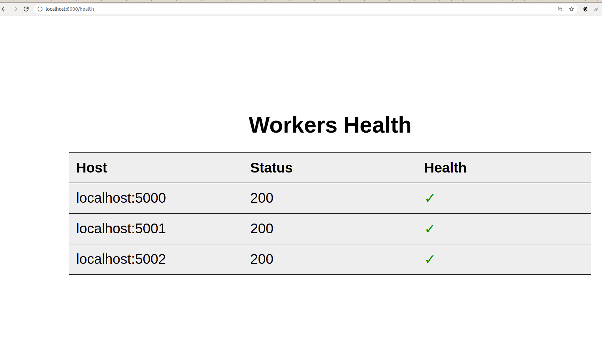

# Distributed Key Value Store

Distrubute Key Value Store uses in memory store to store data. A key-value store is a database that stores some value against a given key. The database can be queried using a key to retrieve the value.

# How to run this ?
 - Run the Node(s) server
 - Run the Proxy/Master server
- Call the API(s)

# Run the Node(s) server
 - server.py could be running at different machine or at the same one.
 - Activate virtualenv and install requirements.txt 
    ```sh
    (venv)batham@neelesh:~/work/distributed_store$ pip install -r requirements.txt
    ```
- Run Single instance run server.py with port number.
   ```sh
    $ python server.py 5000
    ```
    OR
    
- To run Mutiple servers in local use the sh start_workers.sh script.
   ```sh
    $ sh start_workers.sh 5000 5001 5002
    ```
    This will spin up three different server nodes. 


# Run the Proxy/Master server
  - Once the workers are up run the Proxy/Master server 
    ```sh
    $ python ProxyServer.py localhost:5000 localhost:5001 localhost:5002
    ```
- If the host params are not passed it will  look into config.yml
    ```py
    workers:
      - worker1:
          host: localhost
          port: 5000
    
      - worker2:
          host: localhost
          port: 5001
    
      - worker3:
          host: localhost
          port: 5002
    ```
    
- Can also be run start by start_master.sh file
    ```sh
    $ sh start_master.sh localhost:5000 localhost:5001 localhost:5002
    ```
    
    
# API
- SET
- GET
- DELETE
- HEALTH
##### SET:
 
###### To SET the key - value pair in store
 ```sh
 curl -H 'Content-Type: application/json' -X PUT \
-d '[{"key": "1","value": "Neelesh"},{"key": "2","value": "Batham"}]'
http://localhost:8000/set
 ```
    
##### GET:
###### To GET the key - value pair in store

 ```sh
 curl -H 'Content-Type: application/json' -X POST \
-d '[{"key": "1"}]'
http://localhost:8000/get
 ```
    
##### DELETE/EXPIRE:
###### To EXPIRE the key - value pair in store

 ```sh
 curl -H 'Content-Type: application/json' -X POST \
-d '[{"key": "1"}]'
http://localhost:8000/delete
 ```
##### HEALTH/STATUS
###### To check HEALTH of the workers.

 ```sh
http://localhost:8000/health
```
## UI for checking Workers health
```http://localhost:8000/health ```



